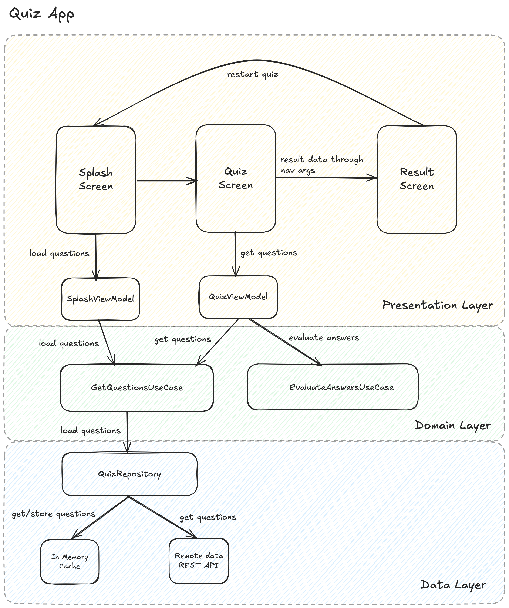

# 🧠 Quiz App

A modern Android quiz app built using **Jetpack Compose**, **MVVM**, and **Clean Architecture**. The
app presents a series of multiple-choice questions, tracks user's answers, evaluates performance,
and displays results with UI feedback for correct/incorrect selections.

---

## ✅ Features & Implementation

### 1. **Splash Screen**

- Loads quiz questions on app start.
- Navigates to `QuizScreen` once loaded.
- **ViewModel:** `SplashViewModel`
- **Use Case:** `GetQuestionsUseCase`
    - Gets the questions for the quiz from the `QuizRepository`. The repository is responsible for
      fetching the data and storing it in the cache.

### 2. **Quiz Screen**

- Displays one question per page using `HorizontalPager`.
- Each question has multiple options.
- User can:
    - Select an option.
    - Navigate to next/previous question by tapping the "Next" button or swiping the screen.
    - Submit quiz at the end.
- **ViewModel:** `QuizViewModel`
    - Maintains:
    - User answers.
    - Streaks (consecutive correct answers).
    - Current question index.
- **Use Cases:**
    - `GetQuestionsUseCase`
        - Gets the questions for the quiz from the `QuizRepository`
    - `EvaluateAnswersUseCase`
        - Evaluates the user's answers against the correct answers and returns result.

### 3. **Result Screen**

- Displays:
    - Total questions
    - Correct, Incorrect, Skipped
    - Highest streak achieved
- Gets result data through **NavArgs**
- Option to **Restart Quiz** (navigates to `SplashScreen`)

---

## 🧱 Architecture

This app follows **Clean Architecture** principles with the following layers:

### Presentation Layer

- Jetpack Compose UI
- ViewModels (`SplashViewModel`, `QuizViewModel`)

### Domain Layer

- Use cases: `GetQuestionsUseCase`, `EvaluateAnswersUseCase`
- Pure Kotlin logic, no Android dependencies

### Data Layer

- Repository: `QuizRepository`
- Data sources: In-memory cache and remote REST API